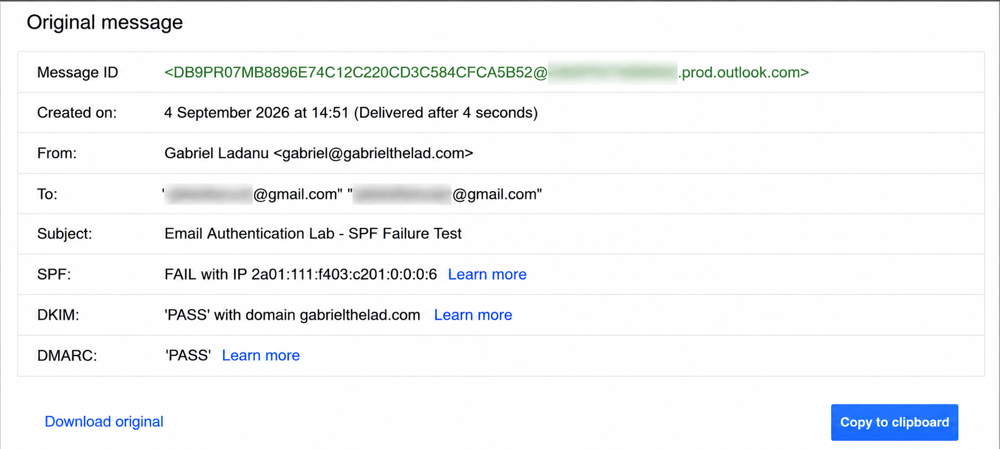
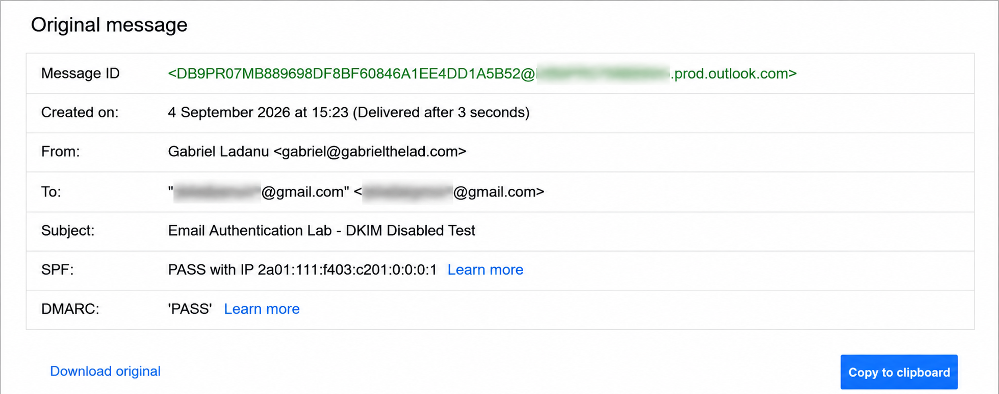
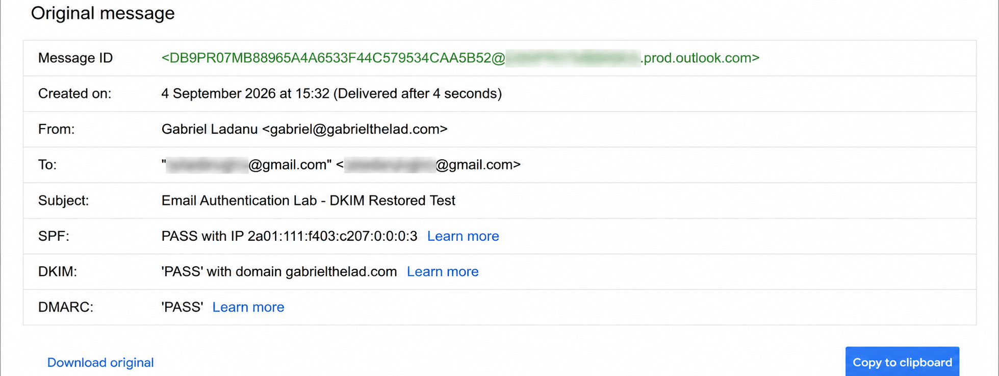
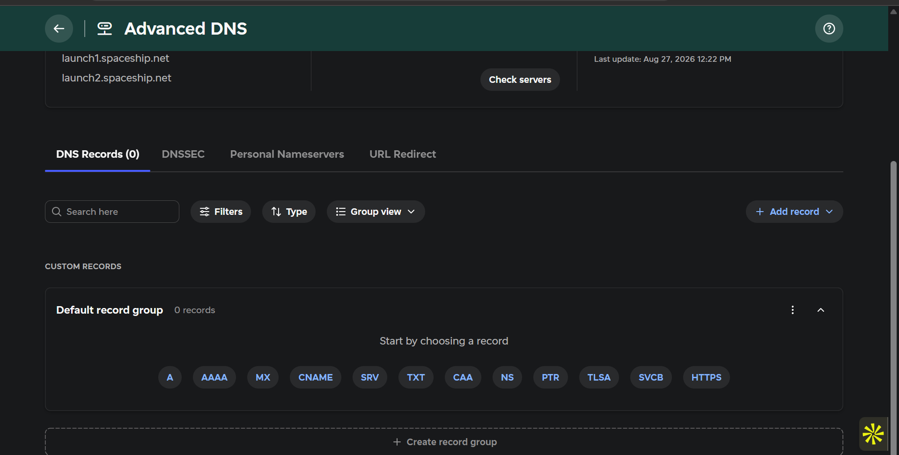
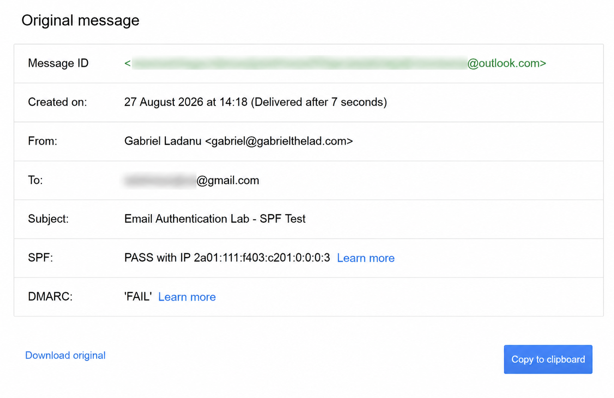
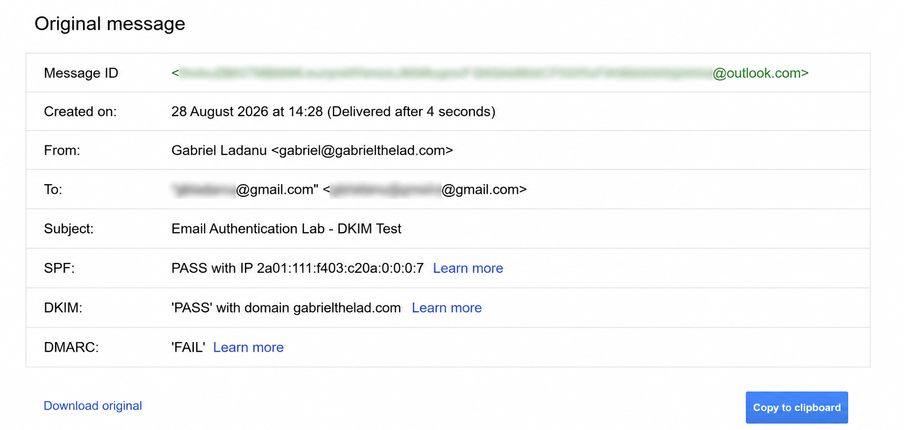
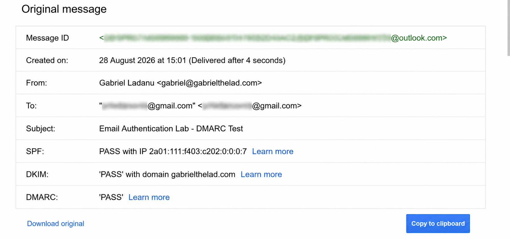
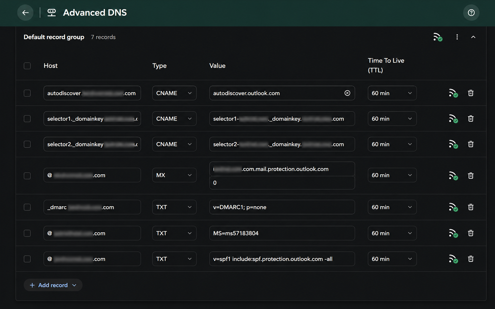

# Email Authentication Security Lab

## Overview

This project documents the implementation and validation of email authentication controls for a custom domain using Microsoft 365 Exchange Online and Spaceship DNS.

The objective is to understand how SPF, DKIM, and DMARC work together to establish domain-level email authenticity, prevent spoofing, and provide policy-based protection against unauthorized use of a domain.

Rather than only configuring DNS records, the lab validates each control through public DNS queries, real email delivery, and message-header analysis.

---

## Lab Environment

| Component | Platform |
|---|---|
| Domain | gabrielthelad.com |
| DNS Provider | Spaceship |
| Email Platform | Microsoft 365 / Exchange Online |
| Receiving Mailbox | Gmail |
| DNSSEC | Enabled |
| DNS Validation | nslookup / public DNS resolvers |

---

## Project Objectives

- Establish a clean DNS baseline before configuration
- Configure Microsoft 365 mail routing
- Implement SPF
- Configure and enable DKIM signing
- Deploy DMARC initially in monitoring mode
- Validate SPF, DKIM, and DMARC through real email traffic
- Analyze authentication results in message headers
- Perform controlled authentication failure tests
- Observe DMARC reporting and policy behavior
- Progress toward stronger DMARC enforcement

---

## 1. Initial DNS Baseline

Before connecting the domain to Microsoft 365, the existing DNS configuration was documented.

### Baseline Results

| Record | Initial Status |
|---|---|
| MX | Not configured |
| TXT | Not configured |
| SPF | Not configured |
| DKIM Selector 1 | Not configured |
| DKIM Selector 2 | Not configured |
| DMARC | Not configured |
| DNSSEC | Enabled |

Public DNS lookups were performed to verify that the records did not exist before implementation.

---

## 2. Microsoft 365 Mail Configuration

A Microsoft 365 Business tenant was configured with Exchange Online and the custom domain was verified using a Microsoft-provided TXT record.

Mail routing was then configured using an MX record pointing to Microsoft 365.

Additional configuration included:

- Microsoft domain ownership verification
- Exchange Online MX routing
- Outlook Autodiscover
- Administrative account MFA

---

## 3. SPF Implementation

The following SPF policy was published:

```text
v=spf1 include:spf.protection.outlook.com -all
```

### Purpose

The SPF policy authorizes Microsoft 365 infrastructure to send email on behalf of `gabrielthelad.com`.

### Validation

The SPF record was:

1. Published in Spaceship DNS.
2. Verified using public DNS resolvers.
3. Tested by sending a real message through Microsoft 365.
4. Validated through Gmail message-header analysis.

### Result

```text
SPF: PASS
```

The authenticated envelope sender used the `gabrielthelad.com` domain.

**Status: PASS ✅**

---

## 4. DKIM Implementation

Microsoft 365 DKIM keys were generated for the custom domain.

Two DKIM CNAME selectors were published:

```text
selector1._domainkey.gabrielthelad.com
selector2._domainkey.gabrielthelad.com
```

The selectors point to Microsoft-managed DKIM infrastructure.

After DNS propagation was confirmed, DKIM signing was enabled in Microsoft 365.

### Validation

A new message was sent from the Microsoft 365 mailbox to Gmail.

The message header showed:

```text
DKIM: PASS
Signing domain: gabrielthelad.com
Selector: selector1
```

This confirmed that Microsoft 365 was successfully signing outbound messages using the custom domain.

**Status: PASS ✅**

---

## 5. DMARC Implementation

DMARC was initially deployed in monitoring mode.

The following policy was published:

```text
v=DMARC1; p=none
```

The record was created at:

```text
_dmarc.gabrielthelad.com
```

### Why `p=none`?

The initial objective is to monitor authentication and alignment before progressing toward stronger enforcement.

A `p=none` policy allows DMARC results to be observed without requesting that receiving mail systems quarantine or reject failing messages.

### Validation

After DNS propagation, another test message was sent through Microsoft 365 to Gmail.

The result was:

```text
SPF: PASS
DKIM: PASS
DMARC: PASS
```

This confirmed that the message successfully met DMARC authentication and alignment requirements.

**Status: PASS ✅**

---
## 6. Controlled SPF Failure Test

To test how DMARC behaves when SPF fails, the SPF policy was temporarily changed from:

```text
v=spf1 include:spf.protection.outlook.com -all
```

to:

```text
v=spf1 -all
```

This intentionally caused Microsoft 365 mail to fail SPF authentication while DKIM signing remained enabled.

### Expected Result

```text
SPF: FAIL
DKIM: PASS
DMARC: PASS
```

### Actual Result

Gmail reported:

```text
SPF: FAIL
DKIM: PASS
DMARC: PASS
```

This confirmed that DMARC does not require both SPF and DKIM to pass.

In this test, SPF failed, but DMARC still passed because DKIM passed and aligned with the visible `From` domain.

### Evidence



### Recovery

After the test, the original Microsoft 365 SPF policy was restored:

```text
v=spf1 include:spf.protection.outlook.com -all
```

Public DNS was checked again to confirm that the correct SPF record had been restored.

**Status: Controlled SPF failure test completed successfully ✅**

---
## 7. Controlled DKIM-Disabled Test

To observe how DMARC behaves when custom-domain DKIM signing is unavailable, DKIM signing for `gabrielthelad.com` was temporarily disabled in Microsoft Defender.

The SPF configuration was left unchanged.

### Expected Result

```text
SPF: PASS
DKIM: Not available for the custom domain
DMARC: PASS
```

### Actual Result

Gmail reported:

```text
SPF: PASS
DKIM: Not shown
DMARC: PASS
```

This demonstrated that DMARC can still pass without DKIM when SPF passes and aligns with the visible `From` domain.

### Evidence



### Recovery

After the test, DKIM signing for `gabrielthelad.com` was re-enabled in Microsoft Defender.

A new validation message was then sent to confirm that normal authentication had been restored.

The result was:

```text
SPF: PASS
DKIM: PASS
DMARC: PASS
```



This confirmed that DKIM signing was successfully restored and the domain returned to its normal authentication state.

**Status: Controlled DKIM-disabled test and recovery completed successfully ✅**

---
## Authentication Results

The final successful test produced the following results:

| Control | Result |
|---|---|
| SPF | PASS |
| DKIM | PASS |
| DMARC | PASS |

The sending domain was:

```text
gabrielthelad.com
```

Microsoft 365 was authorized through SPF, outbound messages were DKIM-signed using the custom domain, and DMARC successfully validated the authenticated message.

---

## Current DNS and Authentication State

| Control | Status |
|---|---|
| MX Routing | ✅ Configured |
| SPF | ✅ PASS |
| DKIM | ✅ PASS |
| DMARC | ✅ PASS |
| DMARC Policy | `p=none` |
| DNSSEC | ✅ Enabled |

---

## Key Findings

This implementation demonstrated that SPF, DKIM, and DMARC perform different but complementary roles in email authentication.

### SPF

SPF defines which mail infrastructure is authorized to send email on behalf of the domain.

### DKIM

DKIM applies a cryptographic signature to outbound messages, allowing receiving systems to verify that the message was signed by an authorized domain and was not improperly modified in transit.

### DMARC

DMARC builds on SPF and DKIM by evaluating authentication and domain alignment and applying a domain-owner-defined policy.

A message does not require both SPF and DKIM to pass DMARC. DMARC can pass when at least one supported authentication mechanism passes and aligns with the visible `From` domain.

---

## Before and After

### Before Configuration

```text
MX: Not configured
SPF: Not configured
DKIM: Not configured
DMARC: Not configured
```

### After Configuration

```text
MX: Microsoft 365 / Exchange Online
SPF: PASS
DKIM: PASS
DMARC: PASS
DMARC Policy: p=none
```

---

## Next Phase

The next phase of the project will focus on controlled testing and policy behavior.

Planned areas include:

- SPF failure scenarios
- DKIM failure scenarios
- DMARC alignment behavior
- Authentication failure analysis
- DMARC reporting
- Progression from `p=none` toward stronger enforcement

---

## Security Note

All testing is performed using domains, accounts, and mailboxes under my control.

Credentials, passwords, authentication tokens, private cryptographic material, recovery information, and other sensitive information are excluded from this repository.

---
## Evidence

### Initial DNS Baseline

The domain started with no custom DNS records configured.



---

### SPF Validation

A real message sent through Microsoft 365 was validated by Gmail.



---

### DKIM Validation

After publishing the Microsoft 365 DKIM selectors and enabling signing, Gmail validated the DKIM signature for `gabrielthelad.com`.



---

### DMARC Validation

After publishing the initial `p=none` DMARC policy, Gmail confirmed successful SPF, DKIM, and DMARC authentication.



---

### Final DNS Configuration

The final DNS configuration includes Microsoft 365 mail routing, SPF, DKIM selectors, DMARC, and Autodiscover.



## Project Status

🚧 **In Progress**

Core SPF, DKIM, and DMARC implementation and real-world validation are complete.

Controlled failure testing, reporting, and DMARC policy enforcement are the next stages.
